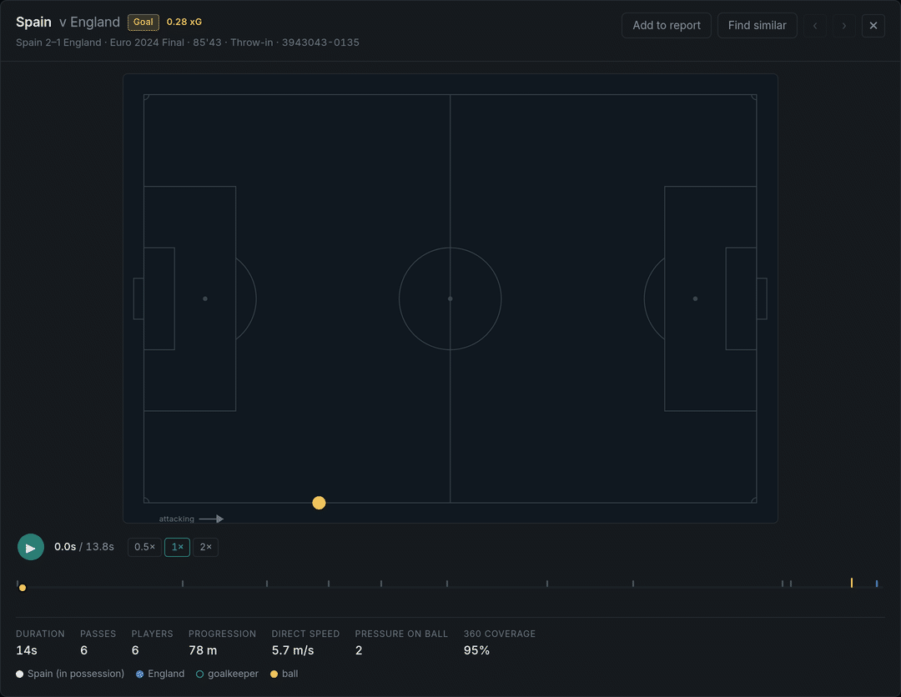
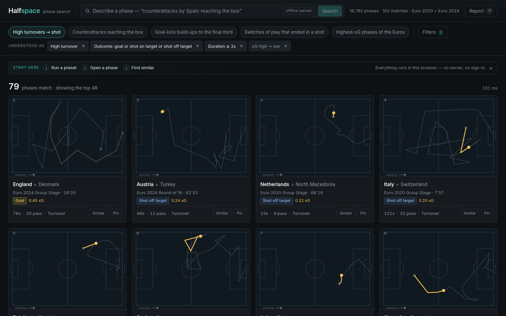

# Halfspace

<p align="center">
  
</p>

An analyst watching an opponent wants to ask things like *"show me every time they
played out from the back against our high press and we won the ball in their
defensive third."* Today that means scrubbing video and hand-tagging clips, hours
per match, and the answer lives in one person's spreadsheet. Halfspace makes those
passages of play searchable instead: it cuts 102 matches of StatsBomb Open Data
into **16,782 phases**, gives each one a set of football features you can filter on —
where it started, how it started, how fast it went forward, whether it was a high
regain, a counterattack, a switch, how it ended — and returns the matches as a
ranked grid of animated pitches. Click one and it replays full-size with the other
players' positions from StatsBomb 360. Click *find similar* and comparable passages
surface from every other match in the tournament.

**Live: https://danfirsten.github.io/halfspace/**

Everything runs in the browser. There is no backend to search against, nothing to
keep warm, and nothing that can be down when you open the link.

---

## The ninety-second tour

1. **Land on it.** A query is already running — *High turnovers → shot* — and 48
   animated phase thumbnails are on screen. There is no empty state.
2. **Read the grid.** Each card is a real ball path on a correctly proportioned
   pitch, attacking left to right, labelled with the match, the clock, the outcome
   and the phase's best xG.
3. **Open one.** Full-size replay: the ball with its trail, the 360 freeze frames
   as player dots, a scrubbable timeline with a tick for every event, and the
   phase's numbers underneath.
4. **Find similar.** Cosine similarity over a 74-dimensional phase vector,
   computed in the browser with DuckDB's `list_dot_product`, ranked in about
   130 ms once the vectors are loaded.
5. **Type your own.** *"quick counterattacks by Spain that reached the box"* →
   the app shows you the query it understood as editable chips before it shows
   you results, and tells you what it had to drop.
6. **Keep what's useful.** Pin phases as you go, and the report page assembles
   them into a shareable opposition-scouting document — the whole thing encoded
   in the URL.

<p align="center">
  
</p>

More screenshots: [results grid](docs/screenshots/results-grid.png) ·
[filter builder](docs/screenshots/filter-builder.png) ·
[natural language](docs/screenshots/natural-language.png) ·
[find similar](docs/screenshots/find-similar.png) ·
[insights](docs/screenshots/insights.png) ·
[scouting report](docs/screenshots/report.png) ·
[mobile](docs/screenshots/mobile-player.png)

Every image above is regenerated from the production build by
[`web/shoot.mjs`](web/shoot.mjs); the hero animation by
[`web/gif.mjs`](web/gif.mjs).

---

## Architecture

```
  ingest/     Python. Polars + DuckDB. Raw StatsBomb JSON → possession chains →
              phase features → Parquet. Runs offline on my machine, output
              committed, never runs in production.
                                    │
                                    ▼
  web/        TypeScript + React. Loads the Parquet and queries it with
              DuckDB-WASM in the browser. Static files on GitHub Pages.
                                    ▲
                                    │  (optional)
  api/        FastAPI. One job: turn English into a validated PhaseQuery
              object. Never touches the data. The app works without it.
```

Three choices I would defend in a room:

**Search runs client-side, in DuckDB-WASM.** `phases.parquet` is 2.90 MB — small
enough to hand the browser whole. Every filter, sort and similarity search is real
SQL executed locally, which means preset queries land in **46–134 ms**, hosting
costs nothing, there is no cold start, and the demo cannot be taken down by an
instance I forgot to pay for. It also keeps SQL visibly central rather than hidden
behind an ORM.

**The language model emits a validated DSL, never SQL.** `PhaseQuery` is a closed
enum of columns, six operators, typed values, one optional sort and a limit clamped
to 1–96. The model's only job is English → that object; a Zod schema validates it
(`web/src/dsl/schema.ts`, mirrored by Pydantic in `api/dsl.py`) and one tested
compiler turns it into SQL (`web/src/dsl/compile.ts`). A hallucinated column is a
validation error with a named path, not a plausible wrong answer. And the parsed
query is **always rendered back as editable chips before results** — an analyst can
see what it understood and fix it. You cannot show a non-technical colleague a SQL
string and call that transparency.

**The app degrades gracefully.** The visual filter builder can construct every query
the natural-language path can, and when the API is absent the browser falls back to
a deterministic keyword parser (`web/src/dsl/heuristic.ts`) that emits the same
object and says so on screen. The deployed site has no API behind it at all — what
you see live is the degraded path, and it is fully functional. No demo of mine dies
on someone else's uptime.

---

## What a "phase" is, and the definitions behind the filters

Every definition is stated precisely enough to be wrong, and every threshold was
measured from the data rather than chosen. The full set — with the distributions
behind each number — is in **[docs/phase-definitions.md](docs/phase-definitions.md)**.
The short version:

**A phase is one StatsBomb possession chain**: every event sharing
`(match_id, period, possession)`. Period is part of the key because StatsBomb's
possession counter runs straight through half-time. Penalty shootouts are excluded
(one shot each, all from the same coordinate). Consecutive possessions by the same
team are *not* merged — one in three possession increments is a restart to the same
team rather than a turnover, and a throw-in is a new attacking problem against a new
defensive shape. So a phase is "a passage of play between restarts", not "a spell of
having the ball". 16,782 of them, a median of 164 per match.

**`high_press_regain`** — the phase began with an open-play turnover, the ball was won
in the **final third** (x ≥ 80), **and** the winning team was demonstrably pressing:
either the ball-winning event carries StatsBomb's `counterpress` flag, or that team
registered a `Pressure` event in the **5 seconds** before the phase started. The
pressing clause is not decoration — it removes 66 of 329 final-third turnovers that
were lucky ricochets. 263 phases (1.57%), and they produce a shot **30.4%** of the
time against a 13.8% baseline.

**`counterattack`** — StatsBomb's own `From Counter` tag, **or** an open-play turnover
in the team's own half (x ≤ 60) that advanced ≥ 18 yards upfield at **≥ 4.3 yd/s** and
reached the final third. 4.3 yd/s is not a guess: it is the **10th percentile of the
possessions StatsBomb itself tags `From Counter`**, so the rule reads "at least as
direct as the slowest tenth of the moves StatsBomb calls a counter". Their tag alone
covers 0.69% of possessions, too sparse to search; this covers 4.5%, with a 27.1%
shot rate.

**`switch_of_play`** — a pass that moved the ball **≥ 40 yards across** the pitch, or
one StatsBomb flagged `pass.switch`. Over 20,469 passes the 40-yard cut-off reproduces
their flag *exactly*: no unflagged pass reaches 40 yards, no flagged pass falls below
it. 35 yards would add 489 false positives. The flag and the geometric rule turn out
to be the same rule.

**`outcome`** is a precedence list — `goal` > `shot_on_target` > `shot_off_target` >
`lost_ball` > `out_of_play` > `foul_won` > `end_of_period`. The shot tests scan the
whole phase; the rest look only at the last meaningful event, skipping
administrative ones. So the precedence only ever decides "the move produced a shot
**and then** the ball went out", which should be labelled by the shot, and is.

**`goal_conceded`** — six phases in the dataset ended in a goal for the team that did
*not* own the chain: the ball changed hands and went in so fast that StatsBomb never
opened a new possession. Nedim Bajrami's 23-second goal against Italy is one. They
cannot be `outcome = 'goal'` without crediting Italy with Albania's goal, so they get
their own flag, and the accounting closes exactly — 259 goals in the raw data = 253
phases with `outcome = 'goal'` + 6 `goal_conceded`, asserted per competition in the
validation suite.

Everything is in **one coordinate frame**: the phase's team attacks x = 0 → 120. The
web app never flips anything. Opponent events mirror at `(120.1 − x, 80.1 − y)` — not
120/80 — because event locations sit on a 0.1-offset grid, and the wrong constant
silently breaks the join between an event and its own 360 actor dot.

---

## Running it

```bash
# the app
cd web && npm install && npm run dev            # http://localhost:5173

# rebuild the data from scratch (~1.1 GB download, ~16 s build on 4 cores)
cd ingest && python3 -m venv .venv && ./.venv/bin/pip install -r requirements.txt
./.venv/bin/python -m halfspace_ingest.download
./.venv/bin/python -m halfspace_ingest.build

# the optional natural-language API
cd api && python3 -m venv .venv && .venv/bin/pip install -r requirements.txt
export ANTHROPIC_API_KEY=...                     # without it, /parse returns 503
.venv/bin/uvicorn main:app --port 8000

# tests
cd ingest && ./.venv/bin/python -m pytest        # 184
cd api    && .venv/bin/python -m pytest -q       #  72
cd web    && npx vitest run                      # 177

# the P2 encoder experiment (PyTorch, deliberately not in requirements.txt)
cd ingest && ./.venv/bin/pip install -r requirements-encoder.txt
./.venv/bin/python -m encoder.train --name v1
./.venv/bin/python -m encoder.evaluate --split validation --ckpt encoder/checkpoints/v1-best.pt
```

Raw StatsBomb JSON never enters the repository — the licence forbids redistributing
it. It caches to `~/.cache/halfspace/statsbomb-raw` (override with
`$HALFSPACE_RAW_DIR`), and a test asserts git tracks none of it.

More detail: [`ingest/README.md`](ingest/README.md) · [`api/README.md`](api/README.md) ·
[`docs/CONTRACT.md`](docs/CONTRACT.md) (the cross-component contract every part was
built against).

---

## Measured performance

The contract set two budgets before anything was built: **first meaningful paint
under 2 s**, **any search under 300 ms**. Both hold.

| | Measured | Budget |
|---|---:|---:|
| First meaningful paint (header, presets, skeleton pitches) | **434 ms** | < 2,000 ms |
| First contentful paint | 280 ms | — |
| Index ready — DuckDB-WASM up, 48 animated results on screen | 1,566 ms | — |
| Preset query over 16,782 phases | **46–134 ms** | < 300 ms |
| Find similar, cold (includes the one-time 2.66 MB vector fetch) | 481 ms | — |
| Find similar, warm | **129 ms** | < 300 ms |
| First meaningful paint, mobile viewport (390 × 844) | 267 ms | < 2,000 ms |

Measured locally, not on GitHub Pages: production build (`npm run build`) served by
`vite preview` over loopback, driven by headless Chromium 141 through Playwright on a
4-core Intel Xeon @ 2.80 GHz / 15 GB Linux box, no network throttling, a fresh browser
context per run. Loopback removes real network latency from the paint numbers, so
treat FMP as a floor; the query times are pure compute and travel unchanged. The
harness that produces them is committed as [`web/shoot.mjs`](web/shoot.mjs) — it also
takes every screenshot in this README, so the numbers and the pictures come from the
same artifact that ships. The five preset timings on the run above were 134, 55, 74,
46 and 72 ms. The app footer shows the last query's time live, so the claim is
checkable in the deployed site rather than only here.

Eager payload: 335 kB of app JS (103 kB gzipped), 33 kB CSS, `phases.parquet` at
2.90 MB and `matches.parquet` at 10.7 kB. DuckDB-WASM (18.1 MB, 4.26 MB gzipped) and
the Vega charting stack (845 kB, 290 kB gzipped) are code-split and loaded after the
skeleton paints; the report page and the 360 frames are fetched only when asked for.
Zero console errors across the whole desktop, mobile and report walkthrough.

---

## The model that didn't ship

The plan allowed a learned upgrade to "find similar": a small self-supervised
Transformer over each phase's event sequence, replacing the hand-built feature
vector — **only if it beat the baseline on a held-out evaluation.**

I wrote the evaluation first and committed it before the first training step
([`ingest/encoder/EVAL.md`](ingest/encoder/EVAL.md), commit `c6b6e71`). It had to be
pre-registered because the obvious evaluation is rigged: 32 of the baseline's 74
dimensions *are* the labels you would score retrieval against. So the primary metric
is split-half retrieval on held-out matches — cut a phase in two, embed each half
independently, and ask whether the second half's nearest neighbour among ~1,900
candidates is its own first half — plus a transfer probe on StatsBomb pass qualifiers
that neither representation is given. The decision rule required a **10% relative MRR
gain**, no Recall@1 regression, and no loss of football content.

It lost. On the untouched test split: **MRR 0.0360 against the baseline's 0.0398**
(0.906×, where 1.10× was required), Recall@1 0.0131 against 0.0193. Two of three
conditions failed and the primary metric failed in the wrong direction. So
`similarity.parquet` is byte-identical to what it was before the experiment, the
build still defaults to `--similarity baseline`, and the encoder stays committed as
the record rather than as a feature.

The interesting part is *how* it lost. The encoder has a **better median rank** on
every split (269 vs 322) while being worse at the top — it reliably learned region
and rhythm and almost never nailed the identifying detail, which is exactly the wrong
shape for a "more like this one" button. And the transfer probe splits along a
football line: the baseline is far better on `cross` (0.896 vs 0.851) and
`through_ball` (0.798 vs 0.677), both *geometric* facts it is handed directly, while
the encoder is far better on `aerial_won` (0.784 vs 0.678) and `head_pass` (0.694 vs
0.628), both *event-sequence* facts the baseline sees only as a count. Each is strong
precisely where its inputs are, which says the next attempt should **concatenate the
two, not replace one with the other** — 74 + 22 dims still fits the 96-dimension
budget. That conclusion has evidence behind it, which is more than I had before
running the experiment.

Full record, including every run and the deviations from the protocol:
[`ingest/encoder/RESULTS.md`](ingest/encoder/RESULTS.md).

---

## Honest limitations

- **This is event data, not tracking data.** Player positions exist only at the
  moments StatsBomb recorded an event, and only for events with a 360 freeze frame.
  Between frames the player dots hold and fade rather than being interpolated —
  I would rather show a stale position honestly than invent a smooth one.
- **3.22% of 360 frames have unknown orientation.** Of 331,383 frames, 94.28% are
  drawn in the event team's frame and 2.50% in the opponent's; the rest cannot be
  classified from the actor dot. The coordinates are still right, but which team a
  dot plays for is uncertain for those. The resolved orientation is stored per frame
  and the player says so on screen when it is unknown.
- **566 phases have no 360 data at all** (3.4%). They still search, filter and
  animate their ball path; they just have no player dots.
- **Grid thumbnails are arc-length, not time-true.** `path_xy` resamples each ball
  path to 20 points evenly spaced *by distance*, so a 40-second build-up and a
  6-second break both read as one clean sweep at thumbnail size. The full player uses
  real timings from `phase_events`. If you compare two thumbnails' speeds, you are
  comparing nothing.
- **Six goals belong to nobody's chain.** They are flagged `goal_conceded` rather
  than silently dropped or mis-credited, but they are an edge case in the source
  data's possession model, not something my segmentation solved.
- **Phase segmentation inherits StatsBomb's possession decisions.** I chose where to
  cut *given* their possession numbers; I did not re-derive possession from events. A
  team keeping the ball for two minutes through three throw-ins produces four phases.
  That is right for searching passages of play and wrong for measuring sustained
  territorial control.
- **Scouting-report notes travel inside the share URL.** The link encodes the whole
  report, including anything typed in the notes field. Nothing is uploaded anywhere —
  which is also why anyone holding the link can read it.
- **Without the API, natural language is keyword matching.** The offline parser is a
  deterministic keyword parser, not a model. It labels itself "offline parser" in the
  UI and lists what it dropped. It handles the phrasings the presets cover and
  degrades visibly, not silently, on anything else.
- **Two tournaments, 29 teams.** Euro 2020 and Euro 2024 are what the open dataset
  offers with full 360 coverage. Nothing here has been validated against club
  football or a full season.

---

## What I'd do with real tracking data

Event data caps what a phase can be *about*. With 25 fps positions for all 22 players,
four things change, and none of them require rewriting the app:

**Features stop being proxies.** `pressure_events` is a count of a subjective tag;
with tracking it becomes **time-to-pressure** — seconds from a receipt until an
opponent is inside a distance threshold, closing at speed. `high_press_regain` stops
needing the "was anyone pressing?" heuristic and becomes measurable directly:
defensive line height, the compactness of the block, how many players were ahead of
the ball when it was lost. Off-ball runs become first-class searchable objects, which
is what analysts actually want — "find me the phases where their full-back was pinned
by a run in behind" is not answerable from events at all.

**Similarity moves from a feature vector to trajectory sets.** Comparing two phases
becomes comparing 22 trajectories rather than 74 numbers — a soft-DTW or optimal-
transport distance over role-normalised paths. Crucially I do not have to guess
whether that is better: the split-half retrieval harness and the pre-registered
decision rule in `ingest/encoder/` are already built and would evaluate it the same
way they evaluated the encoder, against the same baseline.

**Ranking stops being xG-only.** Right now a phase's value is its best shot's xG,
which scores nothing for the move that pulls a back line apart and ends in a
throw-in. Pitch control or a possession-value surface computed from all 22 positions
gives every phase a value at every instant, so "the most dangerous phases that never
produced a shot" becomes a query — and that is a genuinely useful thing to hand a
first-team analyst.

**The application layer is unchanged.** The DSL gains fields; the compiler, the query
chips, the grid, the player, find-similar, the report and the deploy story all stay
exactly as they are. That separation is the point of the architecture, and it is the
part I would expect to still be standing in three years.

---

## Data

<p>
  <a href="https://github.com/statsbomb/open-data">
    
  </a>
</p>

Data provided by StatsBomb. Halfspace is built on
[StatsBomb Open Data](https://github.com/statsbomb/open-data). Used under the
StatsBomb Public Data User Agreement for research and non-commercial analysis.
StatsBomb is not affiliated with this project and does not endorse any analysis
presented here.

No raw StatsBomb data is redistributed in this repository. The committed artifacts
are derived features and coordinates required to render the analysis.
